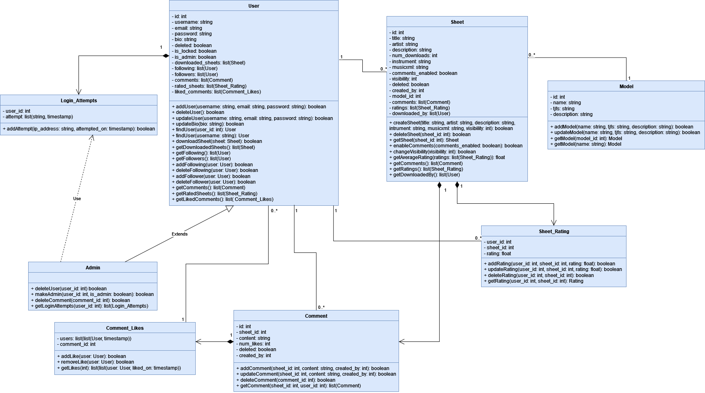

# Knowtes

## Database

### By Michael Brukson, Anthony Nosoff, and Michael Tesis

## Entities & Attributes

- **users**
  - Attributes: <br>
    id: serial <br>
    username: varchar(50) <br>
    email: varchar(50) <br>
    password: varchar(200) <br>
    is_admin: boolean <br>
    is_locked: boolean <br>
    num_failed_attempts: int <br>
    created_at: timestamp <br>
    deleted: boolean 

  - Primary key (PK) and foreign keys (FK) <br>
    PK: id

  - Constraints <br>
    id: UNIQUE <br>
    username: NOT NULL, UNIQUE <br>
    email: NOT NULL <br>
    password: NOT NULL <br>
    deleted: NOT NULL

- **sheets**
  - Attributes: <br>
    id: serial <br>
    created_by: int <br>
    model: int <br>
    title: varchar(200) <br>
    artists: varchar(40) <br>
    description: varchar(400) <br>
    num_downloads: int <br>
    instrument: varchar(20) <br>
    musicxml: varchar <br>
    comments_enabled: boolean <br>
    visibility: enum <br>
    created_at: timestamp <br>
    updated_at: timestamp <br>
    deleted: boolean 

  - Primary key (PK) and foreign keys (FK) <br>
    PK: id <br>
    FK: created_by, model

  - Constraints <br>
    id: UNIQUE <br>
    created_by: NOT NULL <br>
    model: NOT NULL <br>
    title: NOT NULL <br>
    artist: NOT NULL <br>
    num_downlaods: NOT NULL <br>
    instrument: NOT NULL <br>
    deleted: NOT NULL

- **comments**
  - Attributes: <br>
    id: serial <br>
    sheet: int <br>
    created_by: int <br>
    created_at: timestamp <br>
    updated_at: timestamp <br>
    content: varchar(300) <br>
    deleted: boolean 

  - Primary key (PK) and foreign keys (FK) <br>
    PK: id <br>
    FK: sheet, created_by

  - Constraints <br>
    id: UNIQUE <br>
    sheet: NOT NULL <br>
    created_by: NOT NULL <br>
    content: NOT NULL <br>
    deleted: NOT NULL

- **models**
  - Attributes: <br>
    id: serial <br>
    name: varchar(20) <br>
    tjfs: varchar(10) <br>
    description: varchar(400) <br>
    created_at: timestamp

  - Primary key (PK) and foreign keys (FK) <br>
    PK: id

  - Constraints <br>
    id: UNIQUE <br>
    name: NOT NULL <br>
    tjfs: NOT NULL

- **sheet_ratings**
  - Attributes: <br>
    user_id: int <br>
    sheet_id: int <br>
    rating: float <br>
    created_at: timestamp <br>
    updated_at: timestamp

  - Primary key (PK) and foreign keys (FK) <br>
    FK: user_id, sheet_id

  - Constraints <br>
    rating: NOT NULL

- **sheet_downloads**
  - Attributes: <br>
    id: serial <br>
    sheet_id: int <br>
    user_id: int <br>
    downloaded_on: timestamp

  - Primary key (PK) and foreign keys (FK) <br>
    PK: id <br>
    FK: sheet_id, user_id

  - Constraints <br>
    id: UNIQUE <br>
    sheet_id: NOT NULL <br>
    user_id: NOT NULL

- **comment_likes**
  - Attributes: <br>
    user_id: int <br>
    comment_id: int <br>
    liked_on: timestamp

  - Primary key (PK) and foreign keys (FK) <br>
    FK: user_id, comment_id

  - Constraints <br>

  - **user_follows**
  - Attributes: <br>
    follower: int <br>
    followee: int

  - Primary key (PK) and foreign keys (FK) <br>
    FK: follower, followee

  - Constraints <br>
    follower: NOT NULL <br>
    followee: NOT NULL

- **login_attempts**
  - Attributes: <br>
    id: serial <br>
    user_id: int <br>
    ip_address: varchar(40) <br>
    attempted_on: timestamp

  - Primary key (PK) and foreign keys (FK) <br>
    PK: id <br>
    FK: user_id

  - Constraints <br>
    id: UNIQUE <br>

## ER Diagram


## Database Schema

```sql
create table users (
	id serial primary key,
	username varchar(50) not null unique,
	email varchar(50) not null,
	password varchar(200) not null,
	is_admin boolean default false,
	is_locked boolean default false,
	num_failed_attempts int default 0,
	created_at timestamp default CURRENT_TIMESTAMP,
	last_logged_in timestamp default CURRENT_TIMESTAMP,
	deleted boolean not null default false
);

create table login_attmepts (
	id serial primary key,
	user_id int references users(id) on delete cascade,
	ip_address varchar(40),
	attempted_on timestamp default CURRENT_TIMESTAMP
);

create table models (
	id serial primary key,
	name varchar(20) not null,
	tfjs varchar(10) default null, -- NOTE: type TBD
	description varchar(400) default '',
	created_at timestamp default CURRENT_TIMESTAMP
);

create table user_follows (
	follower int not null references users(id) on delete cascade,
	followee int not null references users(id) on delete cascade,
	primary key (follower, followee),
	check (follower <> followee)
);

create type visibility as enum ('public', 'private', 'follower');

create table sheets (
	id serial primary key,
	created_by int references users(id) on delete set null,
	model int references models(id) on delete set null,
	title varchar(200) not null default 'Untitled',
	artist varchar(40) not null default 'Various Artists',
	description varchar(400) default '',
	num_downloads int not null default 0,
	instrument varchar(20) not null,
	musicxml varchar, -- NOTE: size TBD
	comments_enabled boolean default true,
	visibility visibility not null default 'public',
	created_at timestamp default CURRENT_TIMESTAMP,
	updated_at timestamp default CURRENT_TIMESTAMP,
	deleted boolean not null default false
);

create table sheet_downloads (
	id serial primary key,
    sheet_id int not null references sheets(id) on delete cascade,
    user_id int not null references users(id) on delete cascade,
	downloaded_on timestamp default CURRENT_TIMESTAMP
);

create table sheet_ratings (
    user_id int not null references users(id) on delete cascade,
    sheet_id int not null references sheets(id) on delete cascade,
    rating float not null default 0.0 check (rating between 0.0 and 5.0),
    created_at timestamp default CURRENT_TIMESTAMP,
    updated_at timestamp default CURRENT_TIMESTAMP,
    primary key (user_id, sheet_id)
);

-- Comments table, M-1 with sheets
create table comments (
	id serial primary key,
	sheet int not null references sheets(id) on delete cascade,
	created_by int references users(id) on delete set null,
	created_at timestamp default CURRENT_TIMESTAMP,
	num_likes int not null default 0,
	updated_at timestamp default CURRENT_TIMESTAMP,
	content varchar(300) not null,
	deleted boolean not null default false
);

create table comment_likes (
    user_id int not null references users(id) on delete cascade,
    comment_id int not null references comments(id) on delete cascade,
	liked_on timestamp default CURRENT_TIMESTAMP,
    primary key (user_id, comment_id)
);
```

## UML Class Diagram



## Brief explanation of how schema supports site functionalities


