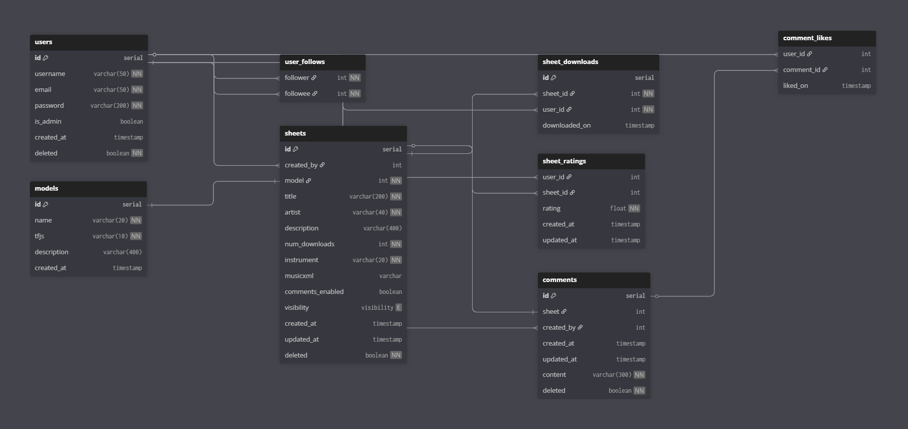

# Knowtes

## Database

### By Michael Brukson, Anthony Nosoff, and Michael Tesis

## Entities & Attributes

- **users**
  - Attributes:  
    id: serial  
    username: varchar(50)  
    email: varchar(50)  
    password: varchar(200)  
    is_admin: boolean  
    is_locked: boolean  
    num_failed_attempts: int  
    created_at: timestamp  
    deleted: boolean 

  - Primary key (PK) and foreign keys (FK)  
    PK: id

  - Constraints  
    id: UNIQUE  
    username: NOT NULL, UNIQUE  
    email: NOT NULL  
    password: NOT NULL  
    deleted: NOT NULL

- **sheets**
  - Attributes:  
    id: serial  
    created_by: int  
    model: int  
    title: varchar(200)  
    artists: varchar(40)  
    description: varchar(400)  
    num_downloads: int  
    instrument: varchar(20)  
    musicxml: varchar  
    comments_enabled: boolean  
    visibility: enum  
    created_at: timestamp  
    updated_at: timestamp  
    deleted: boolean 

  - Primary key (PK) and foreign keys (FK)  
    PK: id  
    FK: created_by, model

  - Constraints  
    id: UNIQUE  
    created_by: NOT NULL  
    model: NOT NULL  
    title: NOT NULL  
    artist: NOT NULL  
    num_downlaods: NOT NULL  
    instrument: NOT NULL  
    deleted: NOT NULL

- **comments**
  - Attributes:  
    id: serial  
    sheet: int  
    created_by: int  
    created_at: timestamp  
    updated_at: timestamp  
    content: varchar(300)  
    deleted: boolean 

  - Primary key (PK) and foreign keys (FK)  
    PK: id  
    FK: sheet, created_by

  - Constraints  
    id: UNIQUE  
    sheet: NOT NULL  
    created_by: NOT NULL  
    content: NOT NULL  
    deleted: NOT NULL

- **models**
  - Attributes:  
    id: serial  
    name: varchar(20)  
    tjfs: varchar(10)  
    description: varchar(400)  
    created_at: timestamp

  - Primary key (PK) and foreign keys (FK)  
    PK: id

  - Constraints  
    id: UNIQUE  
    name: NOT NULL  
    tjfs: NOT NULL

- **sheet_ratings**
  - Attributes:  
    user_id: int  
    sheet_id: int  
    rating: float  
    created_at: timestamp  
    updated_at: timestamp

  - Primary key (PK) and foreign keys (FK)  
    FK: user_id, sheet_id

  - Constraints  
    rating: NOT NULL

- **sheet_downloads**
  - Attributes:  
    id: serial  
    sheet_id: int  
    user_id: int  
    downloaded_on: timestamp

  - Primary key (PK) and foreign keys (FK)  
    PK: id  
    FK: sheet_id, user_id

  - Constraints  
    id: UNIQUE  
    sheet_id: NOT NULL  
    user_id: NOT NULL

- **comment_likes**
  - Attributes:  
    user_id: int  
    comment_id: int  
    liked_on: timestamp

  - Primary key (PK) and foreign keys (FK)  
    FK: user_id, comment_id

  - Constraints  

  - **user_follows**
  - Attributes:  
    follower: int  
    followee: int

  - Primary key (PK) and foreign keys (FK)  
    FK: follower, followee

  - Constraints  
    follower: NOT NULL  
    followee: NOT NULL

- **login_attempts**
  - Attributes:  
    id: serial  
    user_id: int  
    ip_address: varchar(40)  
    attempted_on: timestamp

  - Primary key (PK) and foreign keys (FK)  
    PK: id  
    FK: user_id

  - Constraints  
    id: UNIQUE  

## ER Diagram

## Database Schema

create table users (
	id serial primary key,
	username varchar(50) not null unique,
	email varchar(50) not null,
	password varchar(200) not null,
	is_admin boolean default false,
	is_locked boolean default false,
	num_failed_attempts int default 0,
	created_at timestamp default CURRENT_TIMESTAMP,
	last_logged_in timestamp default CURRENT_TIMESTAMP,
	deleted boolean not null default false
);

create table login_attmepts (
	id serial primary key,
	user_id int references users(id) on delete cascade,
	ip_address varchar(40),
	attempted_on timestamp default CURRENT_TIMESTAMP
);

create table models (
	id serial primary key,
	name varchar(20) not null,
	tfjs varchar(10) default null, -- NOTE: type TBD
	description varchar(400) default '',
	created_at timestamp default CURRENT_TIMESTAMP
);

create table user_follows (
	follower int not null references users(id) on delete cascade,
	followee int not null references users(id) on delete cascade,
	primary key (follower, followee),
	check (follower <> followee)
);

create type visibility as enum ('public', 'private', 'follower');

create table sheets (
	id serial primary key,
	created_by int references users(id) on delete set null,
	model int references models(id) on delete set null,
	title varchar(200) not null default 'Untitled',
	artist varchar(40) not null default 'Various Artists',
	description varchar(400) default '',
	num_downloads int not null default 0,
	instrument varchar(20) not null,
	musicxml varchar, -- NOTE: size TBD
	comments_enabled boolean default true,
	visibility visibility not null default 'public',
	created_at timestamp default CURRENT_TIMESTAMP,
	updated_at timestamp default CURRENT_TIMESTAMP,
	deleted boolean not null default false
);

create table sheet_downloads (
	id serial primary key,
    sheet_id int not null references sheets(id) on delete cascade,
    user_id int not null references users(id) on delete cascade,
	downloaded_on timestamp default CURRENT_TIMESTAMP
);

create table sheet_ratings (
    user_id int not null references users(id) on delete cascade,
    sheet_id int not null references sheets(id) on delete cascade,
    rating float not null default 0.0 check (rating between 0.0 and 5.0),
    created_at timestamp default CURRENT_TIMESTAMP,
    updated_at timestamp default CURRENT_TIMESTAMP,
    primary key (user_id, sheet_id)
);

-- Comments table, M-1 with sheets
create table comments (
	id serial primary key,
	sheet int not null references sheets(id) on delete cascade,
	created_by int references users(id) on delete set null,
	created_at timestamp default CURRENT_TIMESTAMP,
	num_likes int not null default 0,
	updated_at timestamp default CURRENT_TIMESTAMP,
	content varchar(300) not null,
	deleted boolean not null default false
);

create table comment_likes (
    user_id int not null references users(id) on delete cascade,
    comment_id int not null references comments(id) on delete cascade,
	liked_on timestamp default CURRENT_TIMESTAMP,
    primary key (user_id, comment_id)
);

## UML Class Diagram

### Research & Analysis

In order to refine our user's needs, the user's home page will contain an area to provide feedback, identify issues, and make recommendations for site improvement. We will analyze all of the users' feedback and make corresponding changes and enhancements as time and resources allow. We will also include a rating and comment section for each transcription in order to see our transcription's accuracy and user satisfaction.

In order to study competitors, we will first identify apps or sites similar to ours. Some of the competitors that we have already identified are AnthemScore, ScoreCloud, and Melody Scanner. Then we will compare our site's features and performance to theirs. This will include music sheet accuracy, the instruments supported, export formats, pricing, etc. Lastly we will also look at reviews left about our competitors and see if there is anything we can do better than them.

### Design – UI/UX considerations

Knowtes will feature a streamlined layout with a focus on two main aspects: **uploads** and **profiles**. 
The sticky **navigation bar** will make the application cohesive, including links to the following:

- Making uploads
- Exploring profiles
- Viewing your own profile
- Search
- Login
    

Each page layout will have several key elements.   
**Upload and export page:**

- A button to upload content
- A generated dropdown menu to select the instrument to transcribe
- A horizontal (widescreen) or vertical (mobile/portrait) menu to select export type (PDF, MIDI, MusicXML)
- Additional export configuration options
- A button to export the result
    

**Exported music elements:**

- Options to download (leading to export page)
- Favorite button
- Star rating
- Comment buttons that show a list with username, profile pic, content, and star rating (if applicable)
    

**User profile page:**

- Profile picture, username, bio
- Upload, follower, and total favorite counts
- List view of transcribed music
- List view of favorites (if public)
    

**Exploration page:**

- A modular grid view of songs
- Showing related/similar genre songs to previously exported ones
- Genre selection
- Trending songs view (sort by favorite)
- All song listings have profiles associated with them
    

**Search page:**

- Main text field with live-updating results
- Option to search generally or by profile, song, or instrument
- Option to show search results as a grid or list view
    

Knowtes will also take **accessibility measures**, such as:

- Making sure elements are high-contrast for readability
- Shifting or marking elements instead of solely using color changes to indicate importance or interactivity
- Consistent headings and element styles throughout the site
- Modular elements that can resize depending on mobile or pc navigation
- Providing the ability to export to MusicXML to accomodate to those with low vision due to its versatility

### Development

- **Frontend**
  A combination of React, TypeScript, HTML5, and CSS3 will be used. **React** will provide the framework for building the UI and managing the application state efficiently. **TypeScript** will add static typing to JavaScript, improving code maintainability. **HTML5** will structure the content and layout of the web pages. **CSS3** will handle the visual styling and responsive design, making the application look modern and work well on different devices.
- **Backend**
  Node.js, Express.js, PostgreSQL, and RESTful API routes will be used extensively in the backend. **Node.js** will provide the runtime environment for executing server-side JavaScript code, handling requests, and managing application logic. **Express.js** serves as the web application framework for Node.js, enabling routing, middleware integration, and RESTful API creation. **PostgreSQL** serves as the RDBS to store and manage sensitive user data, transcribed music sheets, and admin permissions securely. **RESTful API routes** defines the interface for communication between the frontend and backend, allowing clients to perform operations such as uploading audio, retrieving user data, updating existing data, and will even allow third party applications to leverage the utilities the site provides.
- **Other**
  External music transcription APIs/In house algorithms will allow for the transcribing of music. **JWT** may be used for 2FA.

### Testing

We will create a test plan consisting of the test cases corresponding to each use case of the site. Using these test cases we'll test the functionality, validation, and error display. The key areas to test are: authentication (site registration, login and logout), authorization (the users can only perform actions provided by their roles and permissions), user's input (format of all fields including song upload is correctly validated), the output (ability to correctly display, download, and print the music sheet and other information presented to users), and the interactions between users on the site. Additionally, we will perform load tests to make sure that the site is scalable and can accommodate the desired volume of users with an adequate response speed using software that simulates different amounts of concurrent users.

### Launch & Maintenance

Multiple development channels (alpha, beta, release) implemented as Git branches will be used to separate stable releases from experimental feature platforms and non-thoroughly-tested versions, following the test protocols above. In the event that servers for the application are not running, an automatic restart can be attempted. If failed, features such as AWS CloudWatch or its analogs can alert the team of such events. Bug reporting information will be included in application settings.

## Brief explanation of how schema supports site functionalities

